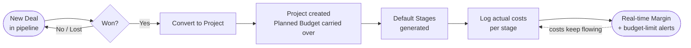
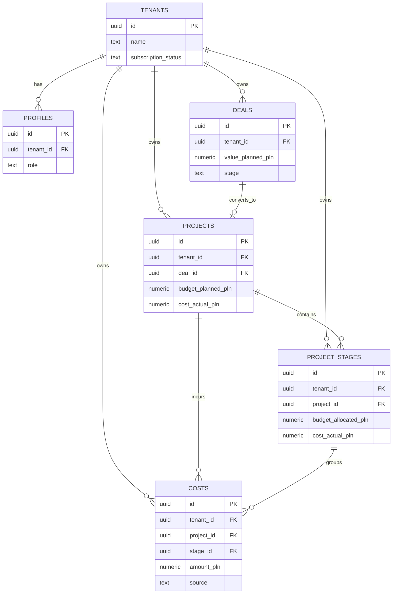

<div align="center">

# ⚡ Perun Core

**The project-first CRM that protects your margin in real time.**

_Zobacz realną marżę każdego projektu — zanim stracisz na nim pieniądze._


</div>

---

## 📖 Table of Contents

1. [What is Perun Core](#-what-is-perun-core)
2. [The Core Idea — the "Magic Moment"](#-the-core-idea--the-magic-moment)
3. [Scope (MVP)](#-scope-mvp)
4. [Tech Stack](#-tech-stack)
5. [Project Structure](#-project-structure)
6. [Database Schema](#-database-schema)
7. [Multi-Tenancy & Row Level Security](#-multi-tenancy--row-level-security)
8. [Business Logic & Calculations](#-business-logic--calculations)
9. [Execution Roadmap](#-execution-roadmap)
10. [🤖 For AI Coding Agents — read this first](#-for-ai-coding-agents--read-this-first)
11. [Getting Started](#-getting-started)
12. [Environment Variables](#-environment-variables)
13. [Design & UX Principles](#-design--ux-principles)
14. [Glossary](#-glossary)

---

## 🎯 What is Perun Core

**Perun Core** is a B2B SaaS — a **project-first CRM** for businesses that win work as projects and live or die by their margin: construction, installation, fit-out, renovation, electrical, HVAC, and similar trades.

Most CRMs stop at the sale. Most project tools ignore the money. The result is the oldest story in project work: you close a deal, celebrate, deliver — and only at the end discover the project barely broke even (or lost money).

Perun Core closes that gap. The pipeline and the project are the **same object's life cycle**, so the budget you sold is carried straight into execution and tracked against real costs as the work happens.

**The promise to the user:** _"See the real margin of every project in real time — and get warned before a project starts bleeding money."_

**Why it can win:**
- **Modern, fast, self-serve UX** — built for owners who want to open it and understand it in 30 seconds, not sit through a multi-day implementation.
- **Polish-first** — PLN, Polish UI, and designed to plug into **KSeF** (mandatory structured e-invoicing in Poland from 2026), so actual-cost data can flow in with minimal manual entry.
- **Frictionless cost capture** — the hard part of every margin tool is getting real costs entered. Perun treats cost entry as the product's core problem, not an afterthought.

> ⚠️ **The #1 product risk, stated up front:** a margin dashboard is only as honest as the cost data behind it. Every design and engineering decision must lower the friction of logging an actual cost. A beautiful dashboard fed by stale data is worthless.

---

## 💡 The Core Idea — the "Magic Moment"



**The flow in words:**

1. A user creates a **Deal** in the sales pipeline (Kanban: `lead → negotiation → won / lost`).
2. When the deal is **won**, the user clicks **"Convert to Project"** and confirms the final **Planned Budget**.
3. The system creates a **Project** linked to the originating deal, **copying `value_planned_pln → budget_planned_pln`**, and auto-generates a set of default **Project Stages**.
4. As work happens, the user logs **actual costs** (per stage). Perun rolls them up and shows **margin in real time**, with a clear visual warning as costs approach the budget limit.

This single flow — **deal → won → convert → track margin** — is the heart of the product. Everything else is supporting cast.

---

## ✨ Scope (MVP)

### ✅ In scope (the "Naked Core")
- Multi-tenant workspaces with strict data isolation (RLS on every table).
- Email/password auth (Supabase Auth) + basic profile/role.
- Sales pipeline (Deals) as a Kanban board.
- "Convert to Project" action (the magic moment).
- Projects with stages and **line-item actual costs**.
- Real-time **margin** (planned budget vs actual cost) at project and stage level.
- Budget-limit **alert banner** (UI logic).

### ❌ Out of scope (do NOT build for MVP)
- Full ERP (accounting ledgers, payroll, warehouse). _That is a separate product (codename **ROD**); Perun grows toward it later via land-and-expand — not now._
- Full cash-flow / AR-AP / runway forecasting (roadmap, post-MVP).
- KSeF import (schema is **prepared** for it — see `costs.source` — but the importer is a later phase).
- Marketing email engine, complex reporting/BI, mobile native apps.
- Anything that does not directly serve **margin protection**.

---

## 🧱 Tech Stack

| Layer | Choice | Notes |
|---|---|---|
| Framework | **Next.js 16** (App Router) | React Server Components by default |
| Mutations | **Server Actions** | No REST API routes for CRUD |
| Language | **TypeScript** (strict) | Types for every DB row + action result |
| Validation | **Zod** | All form/input boundaries |
| Styling | **Tailwind CSS** | Utility-first; `cn()` for conditional classes |
| Components | **shadcn/ui** | Copy-in components (not an npm dependency) |
| Icons | **lucide-react** | |
| Database | **Supabase** (PostgreSQL) | RLS enforced on all tables |
| Auth | **Supabase Auth** | |
| Billing | **Stripe** | Subscriptions; webhook in `app/api/` (Phase 5) |
| Package manager | **pnpm** | |

> 💡 Auth, billing scaffolding, and base UI primitives (buttons, inputs, dialogs) are **ported from an existing internal codebase**. Do not reinvent them — wire up what exists.

---

## 🗂️ Project Structure

Maintain this strict App Router structure:

```text
perun-core/
├── app/
│   ├── (auth)/                # Login, Register, Callback
│   ├── (dashboard)/
│   │   ├── layout.tsx         # Dashboard shell (Sidebar, Header)
│   │   ├── pipeline/          # Deal Kanban board
│   │   ├── projects/          # Project list + active projects
│   │   │   └── [id]/          # Project detail (Stages board + Margin bar)
│   │   └── settings/          # Tenant & user settings
│   ├── api/                   # Webhooks (Stripe) and external integrations ONLY
│   ├── globals.css
│   └── layout.tsx             # Root layout (Providers, Fonts)
├── components/
│   ├── core/                  # Business components (KanbanBoard, MarginBar, CostDialog)
│   ├── ui/                    # shadcn/ui generic components
│   └── layout/                # Sidebar, Topbar
├── lib/
│   ├── supabase/              # Supabase clients (server.ts, client.ts, admin.ts)
│   ├── actions/               # Server Actions (deal.actions.ts, project.actions.ts, cost.actions.ts)
│   ├── utils.ts               # cn(), money/format helpers
│   └── validations.ts         # Zod schemas
├── types/
│   ├── database.types.ts      # Supabase-generated types
│   └── index.ts               # Custom mapped interfaces
└── supabase/
    ├── migrations/            # SQL migration files (timestamped)
    └── seed.sql               # Initial dummy data
```

---

## 🗄️ Database Schema



**Conventions for every table:**
- `id UUID PRIMARY KEY DEFAULT gen_random_uuid()`.
- **`tenant_id UUID NOT NULL` on every business table** — no exceptions. (This is what makes RLS uniform and simple.)
- Money is **always `NUMERIC(14, 2)`** — never `float`/`double`. (Construction budgets reach the millions; `NUMERIC(14,2)` holds up to ~999,999,999,999.99.)
- `created_at TIMESTAMPTZ DEFAULT now()` and `updated_at TIMESTAMPTZ DEFAULT now()` (with a trigger, see below).
- Add an index on `tenant_id` for every table, plus FK columns used in joins.

### 0. Extensions

```sql
create extension if not exists "pgcrypto";       -- gen_random_uuid()
create extension if not exists "moddatetime" schema extensions;  -- updated_at trigger
```

### 1. Core Multi-Tenancy

```sql
-- TENANTS (workspaces)
create table tenants (
  id                  uuid primary key default gen_random_uuid(),
  name                text not null,
  stripe_customer_id  text,
  subscription_status text default 'trialing', -- 'trialing', 'active', 'past_due', 'canceled'
  created_at          timestamptz default now(),
  updated_at          timestamptz default now()
);

-- PROFILES (users mapped to a tenant)
create table profiles (
  id         uuid primary key references auth.users(id) on delete cascade,
  tenant_id  uuid references tenants(id) on delete cascade,
  full_name  text,
  role       text default 'member', -- 'owner', 'admin', 'member'
  created_at timestamptz default now(),
  updated_at timestamptz default now()
);
create index idx_profiles_tenant on profiles(tenant_id);
```

### 2. CRM — Pipeline

```sql
-- DEALS (sales pipeline)
create table deals (
  id                  uuid primary key default gen_random_uuid(),
  tenant_id           uuid not null references tenants(id) on delete cascade,
  title               text not null,
  client_name         text,
  value_planned_pln   numeric(14, 2) default 0.00,
  stage               text default 'lead', -- 'lead', 'negotiation', 'won', 'lost'
  expected_close_date date,
  created_at          timestamptz default now(),
  updated_at          timestamptz default now()
);
create index idx_deals_tenant on deals(tenant_id);
create index idx_deals_stage  on deals(tenant_id, stage);
```

### 3. Project Execution — the Core

```sql
-- PROJECTS (created from won deals)
create table projects (
  id                  uuid primary key default gen_random_uuid(),
  tenant_id           uuid not null references tenants(id) on delete cascade,
  deal_id             uuid references deals(id) on delete set null, -- link to origin
  name                text not null,
  status              text default 'active', -- 'active', 'on_hold', 'completed'
  budget_planned_pln  numeric(14, 2) not null,
  cost_actual_pln     numeric(14, 2) default 0.00, -- maintained by trigger (sum of COSTS)
  start_date          date,
  end_date            date,
  created_at          timestamptz default now(),
  updated_at          timestamptz default now()
);
create index idx_projects_tenant on projects(tenant_id);
create index idx_projects_deal   on projects(deal_id);

-- PROJECT STAGES (milestones / board columns)
create table project_stages (
  id                    uuid primary key default gen_random_uuid(),
  tenant_id             uuid not null references tenants(id) on delete cascade,
  project_id            uuid not null references projects(id) on delete cascade,
  name                  text not null,
  order_index           integer not null,
  budget_allocated_pln  numeric(14, 2) default 0.00,
  cost_actual_pln       numeric(14, 2) default 0.00, -- maintained by trigger
  status                text default 'pending', -- 'pending', 'in_progress', 'done'
  created_at            timestamptz default now(),
  updated_at            timestamptz default now()
);
create index idx_stages_tenant  on project_stages(tenant_id);
create index idx_stages_project on project_stages(project_id);
```

### 4. Costs — the line items that make margin honest

> This table is the heart of "frictionless cost capture." Actual cost is **never typed as a single number** — it is the **sum of cost line items**. This gives an audit trail and lets us plug in KSeF / OCR import later by just setting `source`.

```sql
-- COSTS (individual actual-cost line items)
create table costs (
  id            uuid primary key default gen_random_uuid(),
  tenant_id     uuid not null references tenants(id) on delete cascade,
  project_id    uuid not null references projects(id) on delete cascade,
  stage_id      uuid references project_stages(id) on delete set null, -- optional: unassigned costs allowed
  description   text not null,
  amount_pln    numeric(14, 2) not null,
  category      text, -- 'materials', 'labor', 'subcontractor', 'equipment', 'other'
  supplier_name text,
  incurred_on   date default current_date,
  source        text default 'manual', -- 'manual', 'ksef', 'ocr', 'import'  <-- future-proofing
  document_url  text, -- link to invoice/receipt (Supabase Storage), optional
  created_at    timestamptz default now(),
  updated_at    timestamptz default now()
);
create index idx_costs_tenant  on costs(tenant_id);
create index idx_costs_project on costs(project_id);
create index idx_costs_stage   on costs(stage_id);
```

### 5. Triggers — keep totals and timestamps correct

```sql
-- 5a. Auto-update updated_at on every table (repeat per table)
create trigger handle_updated_at before update on tenants
  for each row execute procedure moddatetime(updated_at);
create trigger handle_updated_at before update on profiles
  for each row execute procedure moddatetime(updated_at);
create trigger handle_updated_at before update on deals
  for each row execute procedure moddatetime(updated_at);
create trigger handle_updated_at before update on projects
  for each row execute procedure moddatetime(updated_at);
create trigger handle_updated_at before update on project_stages
  for each row execute procedure moddatetime(updated_at);
create trigger handle_updated_at before update on costs
  for each row execute procedure moddatetime(updated_at);

-- 5b. Recalculate project + stage actual cost whenever COSTS change
create or replace function public.recalc_actuals()
returns trigger
language plpgsql
security definer
set search_path = public
as $$
begin
  if (tg_op = 'DELETE') then
    update projects
      set cost_actual_pln = coalesce((select sum(amount_pln) from costs where project_id = old.project_id), 0)
      where id = old.project_id;
    if old.stage_id is not null then
      update project_stages
        set cost_actual_pln = coalesce((select sum(amount_pln) from costs where stage_id = old.stage_id), 0)
        where id = old.stage_id;
    end if;
    return old;
  end if;

  -- INSERT or UPDATE: refresh the (new) parents
  update projects
    set cost_actual_pln = coalesce((select sum(amount_pln) from costs where project_id = new.project_id), 0)
    where id = new.project_id;
  if new.stage_id is not null then
    update project_stages
      set cost_actual_pln = coalesce((select sum(amount_pln) from costs where stage_id = new.stage_id), 0)
      where id = new.stage_id;
  end if;

  -- On UPDATE, if the row moved to a different project/stage, also refresh the OLD parents
  if (tg_op = 'UPDATE') then
    if old.project_id is distinct from new.project_id then
      update projects
        set cost_actual_pln = coalesce((select sum(amount_pln) from costs where project_id = old.project_id), 0)
        where id = old.project_id;
    end if;
    if old.stage_id is distinct from new.stage_id and old.stage_id is not null then
      update project_stages
        set cost_actual_pln = coalesce((select sum(amount_pln) from costs where stage_id = old.stage_id), 0)
        where id = old.stage_id;
    end if;
  end if;

  return new;
end;
$$;

create trigger trg_recalc_actuals
  after insert or update or delete on costs
  for each row execute function public.recalc_actuals();
```

---

## 🔐 Multi-Tenancy & Row Level Security

RLS is **mandatory on every table**. To keep policies fast and avoid recursion when reading the current user's tenant, use a single `SECURITY DEFINER` helper.

```sql
-- Helper: returns the tenant_id of the currently authenticated user.
-- SECURITY DEFINER bypasses RLS on profiles inside the function (prevents recursion).
create or replace function public.current_tenant_id()
returns uuid
language sql
stable
security definer
set search_path = public
as $$
  select tenant_id from profiles where id = auth.uid()
$$;
```

Apply the **same four policies to every business table** (`deals`, `projects`, `project_stages`, `costs`). Example for `deals`:

```sql
alter table deals enable row level security;

create policy "tenant can select" on deals
  for select using (tenant_id = public.current_tenant_id());

create policy "tenant can insert" on deals
  for insert with check (tenant_id = public.current_tenant_id());

create policy "tenant can update" on deals
  for update using (tenant_id = public.current_tenant_id())
             with check (tenant_id = public.current_tenant_id());

create policy "tenant can delete" on deals
  for delete using (tenant_id = public.current_tenant_id());
```

`profiles` and `tenants` get their own narrower policies (a user can read/update their own profile and read their own tenant).

> 🔒 **Rule:** never disable RLS "temporarily." Never trust the client to send the correct `tenant_id` — derive it server-side. Server Actions must still set `tenant_id = current_tenant_id()` on insert; RLS is the backstop, not the only line of defense.

---

## 🧮 Business Logic & Calculations

### Margin (the one number that matters)

```ts
// All money values are numbers of PLN with 2 decimals.
const marginPln = budgetPlannedPln - costActualPln;

// Guard against divide-by-zero (a project may have a 0 planned budget edge case).
const marginPct = budgetPlannedPln > 0
  ? (marginPln / budgetPlannedPln) * 100
  : 0;

// Cost consumption (drives the alert + the MarginBar color).
const burnPct = budgetPlannedPln > 0
  ? (costActualPln / budgetPlannedPln) * 100
  : 0;
```

### Health / alert thresholds (used by `MarginBar` and the warning banner)

| Condition | State | UI |
|---|---|---|
| `burnPct < 75` | **healthy** | green bar |
| `75 ≤ burnPct ≤ 90` | **watch** | amber bar |
| `burnPct > 90` | **at risk** | red bar + warning banner |
| `costActualPln > budgetPlannedPln` | **over budget** | red bar + strong alert |

### Status enums (single source of truth)

- `deals.stage`: `lead`, `negotiation`, `won`, `lost`
- `projects.status`: `active`, `on_hold`, `completed`
- `project_stages.status`: `pending`, `in_progress`, `done`
- `costs.category`: `materials`, `labor`, `subcontractor`, `equipment`, `other`
- `costs.source`: `manual`, `ksef`, `ocr`, `import`
- `tenants.subscription_status`: `trialing`, `active`, `past_due`, `canceled`

### `convertDealToProject(dealId)` — the magic moment

1. Validate the deal belongs to the current tenant and is in `won`.
2. Insert a `projects` row: copy `value_planned_pln → budget_planned_pln`, set `deal_id`, `name` (default to deal title), `status = 'active'`.
3. Insert default `project_stages` (Polish UI labels), e.g.:
   `Przygotowanie` (order 0), `Realizacja` (order 1), `Zakończenie` (order 2).
4. Return `{ success: true, data: { projectId } }`.

---

## 🗺️ Execution Roadmap

Build **sequentially**. Do not start a later phase until the current one is complete and working.

### Phase 0 — Foundation & Auth
- [ ] Initialize Next.js (App Router) + Tailwind + shadcn/ui.
- [ ] Supabase clients: `lib/supabase/server.ts`, `client.ts`, `admin.ts`.
- [ ] Migrations: extensions, `tenants`, `profiles` + RLS + `current_tenant_id()` helper.
- [ ] Auth flow (login / register / callback) via Supabase Auth.
- [ ] On register: create a `tenant` and a `profile` linked to it (role `owner`).
- [ ] Dashboard layout (Sidebar + Topbar).

### Phase 1 — The Pipeline (CRM)
- [ ] Migration: `deals` + RLS + indexes.
- [ ] Server Actions: `createDeal`, `updateDeal`, `updateDealStage`, `deleteDeal`.
- [ ] `/pipeline`: Kanban board for deal stages (drag between columns).
- [ ] "Won" modal: confirm/finalize `value_planned_pln` before converting.

### Phase 2 — Convert Deal → Project (the Magic Moment)
- [ ] Migration: `projects`, `project_stages` + RLS + indexes.
- [ ] Server Action `convertDealToProject` (see logic above).
- [ ] Wire the "Convert" button on the Kanban card.

### Phase 3 — Project Board & Margin Dashboard
- [ ] Migration: `costs` + RLS + indexes + `recalc_actuals` trigger.
- [ ] `/projects`: table of all projects with health (Budget vs Cost, margin %).
- [ ] `/projects/[id]`:
  - [ ] Header: dynamic **MarginBar** (planned vs actual, colored by `burnPct`).
  - [ ] Stages list/board; per stage, add/edit/delete **cost line items** via a dialog.
  - [ ] Cost dialog must be **fast**: amount + description + category, sensible defaults, keyboard-friendly.
- [ ] Verify the trigger keeps `cost_actual_pln` correct on add/edit/delete/move.

### Phase 4 — Alerts (UI-only MVP)
- [ ] On `/projects/[id]`: render a warning banner when `burnPct > 90` (and a stronger one when over budget).

### Phase 5 — Billing
- [ ] Stripe subscriptions; webhook in `app/api/stripe/`.
- [ ] Gate the app on `tenants.subscription_status`.

### Phase 6+ — Beyond MVP (do NOT build yet)
- [ ] **KSeF cost import** — pull structured B2B invoices (FA(3)) as `costs` with `source = 'ksef'`. This is the "frictionless capture" payoff; design now, build later.
- [ ] OCR receipt capture (`source = 'ocr'`), invoice attachments via Supabase Storage.
- [ ] Cash-flow / runway view (the bridge toward the separate **ROD** ERP product).
- [ ] Reporting, multi-currency, mobile.

---

## 🤖 For AI Coding Agents — read this first

> **You are an expert Full-Stack TypeScript developer, Next.js architect, and Supabase administrator.** Your objective is to build **Perun Core** exactly as specified in this README. This file is the single source of truth. If it conflicts with your assumptions, the README wins.

### Operating rules (non-negotiable)
1. **Stay in scope.** The core value is **Planned Budget vs Actual Cost (margin protection)**. Do not add features outside the MVP. When in doubt, do less.
2. **Multi-tenancy is mandatory.** Every business table has `tenant_id`. RLS is enabled on every table. Every query is scoped to the tenant.
3. **Strict TypeScript.** Define interfaces/types for every DB row and every API/action response. Validate all inputs with **Zod**.
4. **Server Actions first.** All database mutations happen via Server Actions in `lib/actions/`. **Do not** create REST API routes for CRUD. `app/api/` is only for webhooks/external integrations.
5. **RSC for reads.** Fetch data in React Server Components from the Supabase **server** client; pass data to Client Components as props.
6. **Money is `NUMERIC(14,2)` / `number`.** Never use `float`. Never store money as a string except at the I/O edge.
7. **Reuse, don't reinvent.** Auth, billing scaffolding, and base UI primitives come from an existing internal codebase. Wire up what exists.
8. **No placeholders.** Do not write `// TODO: implement`. Write the real logic. **If you lack context, stop and ask the human.**
9. **Never leak secrets.** The service-role key is server-only. Never expose it to the client or commit it.
10. **Polish UI.** All user-facing copy is in Polish. Code, comments, identifiers, and commits are in English.

### Server Action contract (use everywhere)
```ts
type ActionResult<T = unknown> =
  | { success: true; data?: T }
  | { success: false; error: string };
```
- Always return this shape. Never throw raw errors to the client.
- Revalidate affected paths (`revalidatePath`) after a successful mutation.
- Re-check tenant ownership inside the action (defense in depth) and set `tenant_id` from `current_tenant_id()` on insert.

### Definition of Done (per feature)
- Migration committed under `supabase/migrations/` with RLS + indexes.
- Types regenerated into `types/database.types.ts`.
- Zod schema in `lib/validations.ts`.
- Server Action returns the `ActionResult` shape and revalidates.
- UI handles loading, empty, and error states.
- No TypeScript errors, no `any` leaking across boundaries.

### Suggested starter prompt
> "Read `README.md`. We are on **Phase 0 and Phase 1**. From the DATABASE SCHEMA section, generate the SQL migrations for `tenants` and `profiles` with the `current_tenant_id()` helper and full RLS, then implement the Supabase server/client setup and the Supabase Auth login/register flow (creating a tenant + owner profile on signup). Follow every rule in the 'For AI Coding Agents' section. Do not start Phase 2."

---

## ⚙️ Getting Started

### Prerequisites
- Node.js 20+
- pnpm (`npm i -g pnpm`)
- A Supabase project (cloud or local via the Supabase CLI)

### Install & run
```bash
# 1. Install dependencies
pnpm install

# 2. Configure environment
cp .env.example .env.local   # then fill in the values

# 3. Apply database migrations (Supabase CLI)
supabase link --project-ref <your-project-ref>
supabase db push

# 4. (Optional) seed dummy data
supabase db execute --file supabase/seed.sql

# 5. Run the dev server
pnpm dev   # http://localhost:3000
```

### Regenerate DB types after any schema change
```bash
supabase gen types typescript --linked > types/database.types.ts
```

---

## 🔑 Environment Variables

Create `.env.local` from `.env.example`:

```bash
# --- Supabase ---
NEXT_PUBLIC_SUPABASE_URL=
NEXT_PUBLIC_SUPABASE_ANON_KEY=
SUPABASE_SERVICE_ROLE_KEY=        # SERVER ONLY — never expose to the client

# --- App ---
NEXT_PUBLIC_APP_URL=http://localhost:3000

# --- Stripe (Phase 5) ---
NEXT_PUBLIC_STRIPE_PUBLISHABLE_KEY=
STRIPE_SECRET_KEY=
STRIPE_WEBHOOK_SECRET=

# --- KSeF (Phase 6+, not yet used) ---
# KSEF_API_URL=
# KSEF_TOKEN=
```

> ⚠️ Commit only `.env.example` (with empty values). Never commit `.env.local`. Add it to `.gitignore`.

---

## 🎨 Design & UX Principles

- **30-second clarity.** An owner should open a project and instantly see: am I making money or losing it?
- **Cost entry is sacred.** The "add cost" path must be the fastest thing in the app — minimal fields, smart defaults, keyboard-first. This is where margin tools usually die.
- **Mobile matters.** Work happens on site. Logging a cost from a phone must be effortless (and is the natural home for future OCR/KSeF capture).
- **Polish, warm, professional.** Polish copy throughout; PLN formatting (`1 234,56 zł`); clear, non-jargon labels.
- **Show the money in color.** Margin and burn are communicated by color (green / amber / red) before the user reads a single number. Respect color-blind-safe contrast and never rely on color alone.
- **Modern, not enterprise-clunky.** The whole edge over legacy tools is speed and clarity. Keep it light.

---

## 📚 Glossary

| Term | Meaning |
|---|---|
| **Deal** | A potential sale in the pipeline. |
| **Project** | Execution unit created from a won deal; carries the planned budget. |
| **Stage** | A milestone/phase of a project; can hold its own budget + costs. |
| **Cost** | A single actual-cost line item (material, labor, subcontractor, etc.). |
| **Planned Budget** | What you sold the project for (carried from the deal). |
| **Actual Cost** | Sum of all cost line items (maintained by trigger). |
| **Margin** | Planned Budget − Actual Cost. The number the whole app exists to protect. |
| **Burn %** | Actual Cost ÷ Planned Budget × 100. Drives alerts and colors. |
| **Tenant** | A workspace = one customer company. The unit of data isolation. |
| **KSeF** | Poland's mandatory structured e-invoicing system (2026); future cost-import source. |

---

<div align="center">

**Perun Core** — _build the margin you sold._

</div>

---

## 🚀 Current Status (End of Phase 2)

Phase 2 — **Alerts, Risk Register, and AI Co-Pilot** — has been successfully implemented.

### 💎 Key Features Delivered:
- **Risk Register**: Dedicated table and UI for tracking project risks with probability/impact metadata and mitigation plans.
- **Automated Margin Alerts**: System monitors `burnPct` in real-time.
  - `burnPct > 75%`: Warning (Yellow)
  - `burnPct > 90%`: Critical (Red)
  - `burnPct > 100%`: Budget Overrun (Critical Alert)
- **AI Co-Pilot**: Intelligent project analysis using a margin-protection prompt. Provides summaries, detects threats, and gives strategic recommendations.
- **Enhanced Margin Bar**: Highly visual, dynamic indicator that changes color and state based on financial health.
- **Strict Multi-Tenancy**: All new tables (`risks`, `alerts`) are fully isolated via RLS and `tenant_id`.

### 🛠️ Technical Implementation:
- **Migrations**: `supabase/migrations/003_alerts_risks.sql` adding core tables and RLS.
- **Server Actions**: `generateMarginAlerts`, `createRisk`, and `analyzeProjectRisks` in `lib/actions/`.
- **UI Components**: `AddRiskDialog` for seamless data entry and updated `ProjectDetail` view.

---

## 🚀 Current Status (End of Phase 3)

Phase 3 — **MVP Polishing & Launch Readiness** — is complete. The system is now ready for Early Bird users.

### 💎 Key Features Delivered:
- **Comprehensive Dashboard**: A high-level overview of workspace health, featuring metric cards (Active Projects, Total Margin, Projects at Risk), a visual project list with Margin Bars, and real-time Active Alerts.
- **Onboarding Wizard**: A seamless 3-step experience for new users to set up their company, add their first deal, and get acquainted with the pipeline.
- **Marketing Landing Page**: A conversion-focused homepage with a strong value proposition, "Magic Moment" flow explanation, and Early Bird pricing tiers.
- **Robust Multi-Tenancy**: Onboarding status is now tracked per profile, ensuring a personalized first-run experience for every user.

### 🛠️ Technical Implementation:
- **Migrations**: `supabase/migrations/20240000000004_add_onboarded_to_profiles.sql` adding the onboarding state to users.
- **Server Actions**: New actions in `lib/actions/tenant.ts` for handling tenant name updates and onboarding completion.
- **Components**: `OnboardingWizard` for guided setup and a fully implemented Dashboard page.